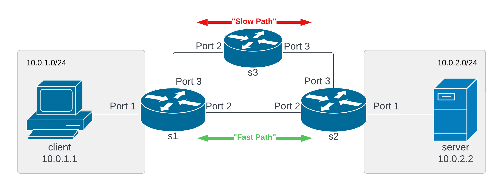

# Exploring P4 and its applications for QoS in video streaming
By: Matthew Bulger

CSE 534

## About
You can find the final report in the file [report.pdf](report.pdf).

All experimentation was done on the [FABRIC Testbed](https://fabric-testbed.net/).

The primary component of this experiment is the Jupyter notebook [qos.ipynb](src/qos.ipynb). This notebook was based off of "p4lang_tutorials.ipynb", which is provided by the FABRIC testbed in their example "complex_recipes/P4_bmv2". I have made extensive modifications to it to facilitate my experiment. This notebook configures a slice with the following topology:

It then installs the Apache HTTP/2 web server on node `h2`, which acts as the server node. AStream is used on node `h1` as the DASH client, which requests segments of the video at various bitrates, depending on the available bandwidth, network conditions, buffer size, etc. 

## Other Sources & Dependencies
This project depends on various other projects for its functionality:

- [BMv2](https://github.com/p4lang/behavioral-model)
	- BMv2 is the software P4 emulator used. Instead of building from source, I used the Docker image provided by FABRIC to install BMv2.
- [Apache Server](https://httpd.apache.org/)
	- The HTTP/2 server used to host the video files on node `h2`.
- [AStream](https://github.com/pari685/AStream)
	- This is the client DASH application used on node `h1` to request segments of the video.
- [Big Buck Bunny Dataset](https://nyu.box.com/shared/static/d6btpwf5lqmkqh53b52ynhmfthh2qtby.tgz)
	- I used this dataset as the test video for DASH streaming, which is streamed from the server to the client.
- [iperf3](https://iperf.fr/iperf-download.php)
	- This was used as the "cross-traffic"; while it is intended to measure the throughput of a connection, it does so by sending tons of packets up to a specified bandwidth cap, which is helpful for congesting the network to test out QoS. 
- [Wondershaper](https://github.com/magnific0/wondershaper)
	- I used this utility to artificially limit the bandwidth of the "slow path" so that the performance of the "slow path" link would be worse than that of the "fast path". Otherwise, the performance of the links would be identical. To make the experiment more consistent, I also used it to limit the bandwidth of the server.

